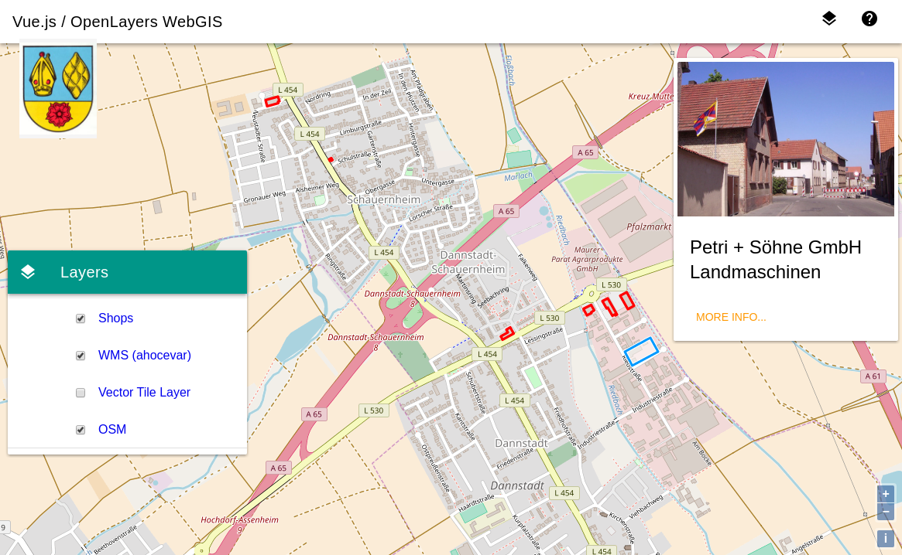

# Wegue (WebGIS with OpenLayers and Vue.js)
Template and re-usable components for webmapping applications with OpenLayers and Vue.js

[](https://travis-ci.org/meggsimum/wegue)
[](https://snyk.io/test/github/meggsimum/wegue)
[](https://david-dm.org/meggsimum/wegue)
[](https://opensource.org/licenses/BSD-2-Clause) [](https://greenkeeper.io/)



Go to the online demo at https://meggsimum.github.io/wegue/

## About
Wegue (**We**b**G**IS with OpenLayers and V**ue**) combines the porwer of [Vue.js](https://vuejs.org/) and the geospatial savvy of [OpenLayers](https://openlayers.org) to make lightweight webmapping applications. For styling and pre-defined UI-components the Material Design
Component Framework [Vuetify](https://vuetifyjs.com/) is used.

It acts as a template to reduce boilerplate work for browser-based mapping application.

### Want to contribute? Yes, please :grinning:
If you want to contribute, please open a Pull Request in the repository.

Ensure that you have clean commits (and messages) and a meaningful description in your PR. Maybe opening an issue first is a good idea.

We look forward to your contributions!

## Development Setup

``` bash
# install dependencies
npm install

# serve with hot reload at localhost:8080
npm run dev

# build for production with minification
npm run build

# build for production and view the bundle analyzer report
npm run build --report

# run unit tests
npm run unit

# run all tests
npm test
```

For detailed explanation on how things work, checkout the [guide](http://vuejs-templates.github.io/webpack/) and [docs for vue-loader](http://vuejs.github.io/vue-loader).

## Who do I talk to? ###
You need more information or support? Please contact us at:

`info__(at)__meggsimum__(dot)__de`

## Credits

The basic project setup was created by https://github.com/vuejs-templates/webpack.

Thanks for this great template! :+1:
