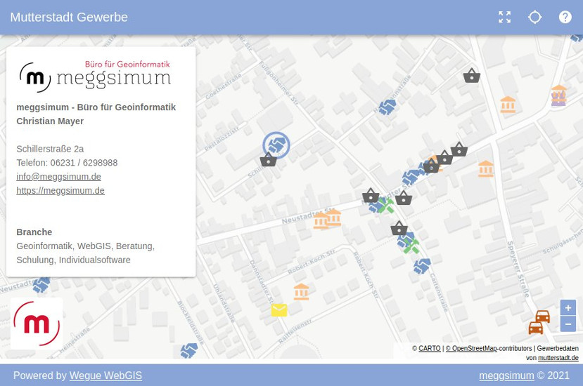
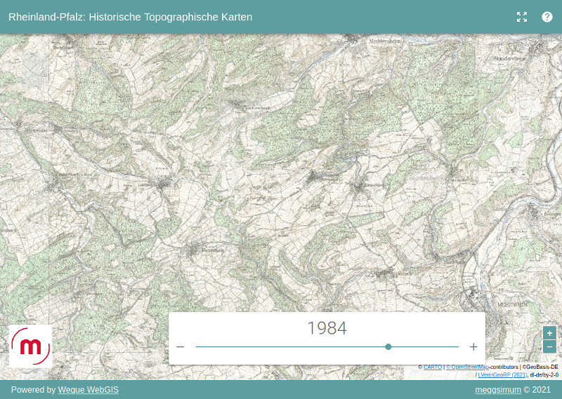
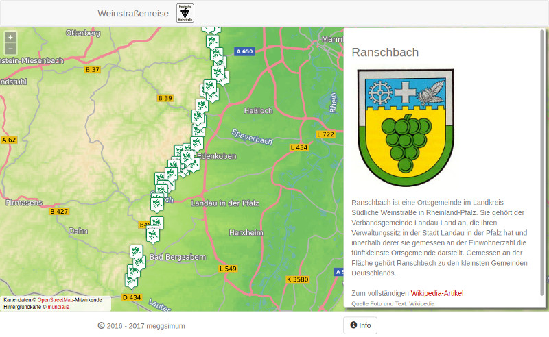
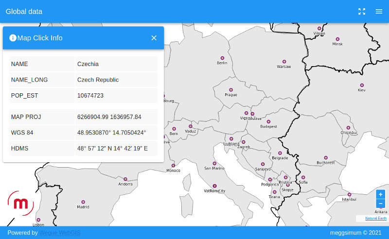
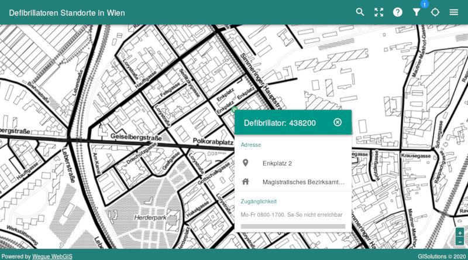

# Gallery

A list of existing Wegue projects.

## [Businesses in Mutterstadt](https://gewerbekarte.meggsimum.de/mutterstadt/)

[Source Code](https://github.com/meggsimum/gewerbekarte-mutterstadt)

A map displaying businesses in the municipality Mutterstadt in Rhineland-Palatinate. The styling is done by category using OpenLayer's style function. By hovering over a point, a label with its name will be displayed. A click on a point opens an info window.

---

## [Time-Travel through Rhineland-Palatinate](https://apps.meggsimum.de/wegue-demos/rlp-historische-tk/?year=1960)

This demo shows how to interact with time-dependent geodata. It visualizes topographic maps of Rhineland-Palatinate in Germany from 1885 until 2020. The data is provided by [Landesamt für Vermessung und Geobasisinformation
Rheinland-Pfalz (LVermGeo)](https://lvermgeo.rlp.de/de/startseite/) as a time enabled Web Map Service (WMS-Time).

---

## [German Wine Route](https://apps.meggsimum.de/weinstrassenreise/#!/)

This applications shows the locations of the [German Wine Route ](https://en.wikipedia.org/wiki/German_Wine_Route). By clicking a location a sidebar appears with information queried from the Wikipedia API. 

---

## [Countries of the World](https://apps.meggsimum.de/wegue-demos/global/)

[Source Code](https://github.com/meggsimum/wegue-demos)

A proof of concept how to include data from a global scale. It displays cities, countries and time zones. By clicking on a location on the map detail information will be shown.

---

## [Architect Oeds de Leeuw Wieland](https://bevinggevoeld.nl/oeds/groot/)

A web application for exploring the work of the Dutch architect Oeds de Leeuw Wieland. By clicking on a map icon a card with detailed information is opened showing both data and images. 

---

## [Rain and Flood Hazard Map](https://www.starkregengefahr.de/baden-wuerttemberg/glems/)

An application showing urban flooding events for different regions depending on various environmental scenarios. It is embeded in a Wordpress page and makes use of the `appCtx` parameter in the URL for instantly navigating to the desired region.

---

## [Traffic Analytics - Geomer Here](https://apps.meggsimum.de/geomer-here/)

This application visualizes time-dependent traffic data from "here". It makes use of a separate time-slider component. The traffic data is loaded as vector tiles.

---

## [SAUBER Study Regions](https://sauber-projekt.de/de/home/pilotregionen/)

This example shows how very basic maps can quickly be generated using Wegue. It shows the outlines of two regions combined with some metadata. Maps like this can be made without any coding. 

---

## [Heron](https://wegue.heron-mc.org/)

This webmap displays windmills in the Netherlands. By clicking on a windmill location a sidebar with additional information and a picture opens up. The application shows how Wegue can be used as a next generation client for [Heron](https://heron-mc.org/) 

---

## [Nature Park "Lüneburger Heide"](https://map.naturpark-lueneburger-heide.de/)

This website shows a classic Web-GIS application. The user can choose from a variety of different layers listed in a layer tree. Additional many common functionalities like measure tools, PDF-export, GeoCoding and data download are implemented.

---

## [Defibrillator Locations in Vienna](https://gisolutionsat.github.io/wegue)

[Source Code](https://github.com/GISolutionsAT/wegue)

This thematic map shows the locations of public defibrillators in Vienna. It comes with an advanced search and filter component. 

---
