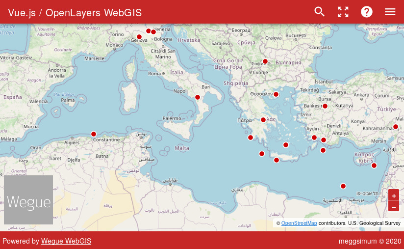

# About

Wegue (**We**b**G**IS with OpenLayers and V**ue**) combines the power of [Vue.js](https://vuejs.org/) and [OpenLayers](https://openlayers.org) to make lightweight webmapping applications. For styling and pre-defined UI-components the Material Design Component Framework [Vuetify](https://vuetifyjs.com/) is used. It acts as a template to reduce boilerplate work for browser-based mapping applications.




## Quickstart

Clone the repository

```shell
git clone https://github.com/meggsimum/wegue
cd wegue
```

Install the JavaScript dependencies

```shell
npm install
```

Initialize the Wegue app

```shell
npm run init:app
```

Serve with hot reload at [localhost:8081](http://localhost:8081)

```shell
npm run dev
```

Build for production with minification

```shell
npm run build
```

This [video tutorial](https://www.youtube.com/watch?v=9cq21F1x2sw) also walks you through the basics steps of setting up Wegue.
