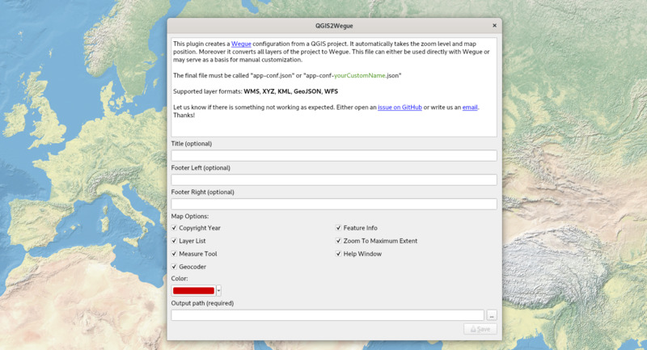

# QGIS Plugin

Adding many layers to a configuration file can be laborious, this is where `QGIS2Wegue` ([GitHub Repository](https://github.com/meggsimum/qgis2wegue)) comes in handy. It converts all layers of a QGIS project into a valid Wegue configuration. This works for `WMS`, `XYZ`, `KML`, `GeoJSON`, `WFS`.

## Usage

- Add all your desired layers to QGIS
- Open the plugin, chose a filepath and click `OK`
- Now you have a configuration file that works with Wegue 

## Installation

QGIS2Wegue is available in the offical [QGIS plugin repository](https://plugins.qgis.org/plugins/qgis2wegue/). Download via `Plugins` --> `Manage and Install Plugins ...`. Make sure to enable `experimental` plugins in the `Settings` menu.

